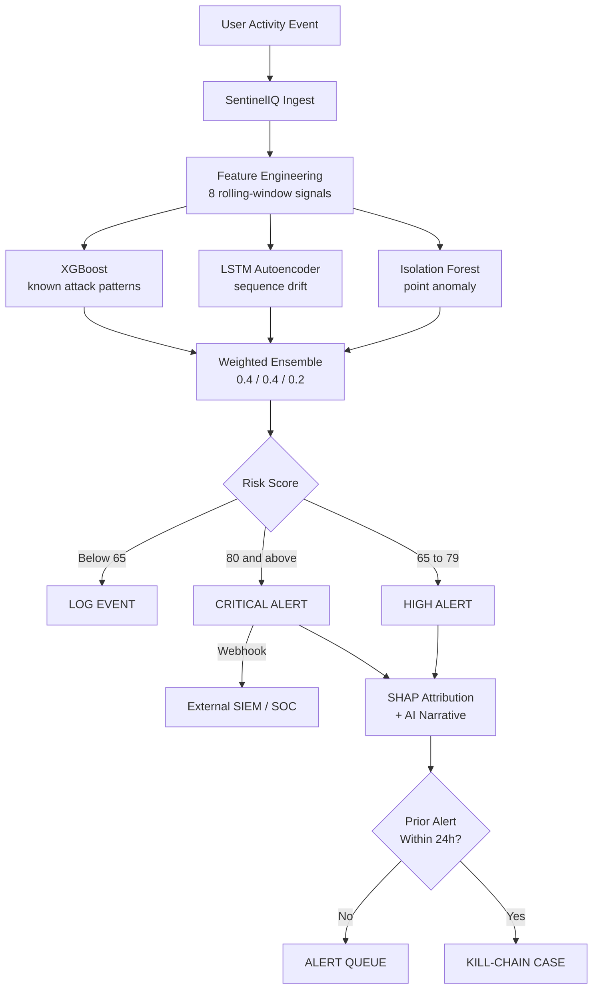
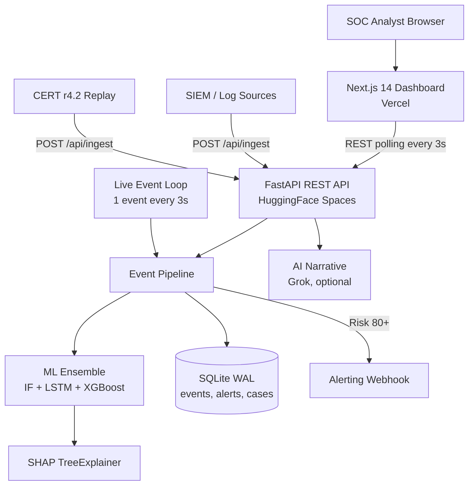
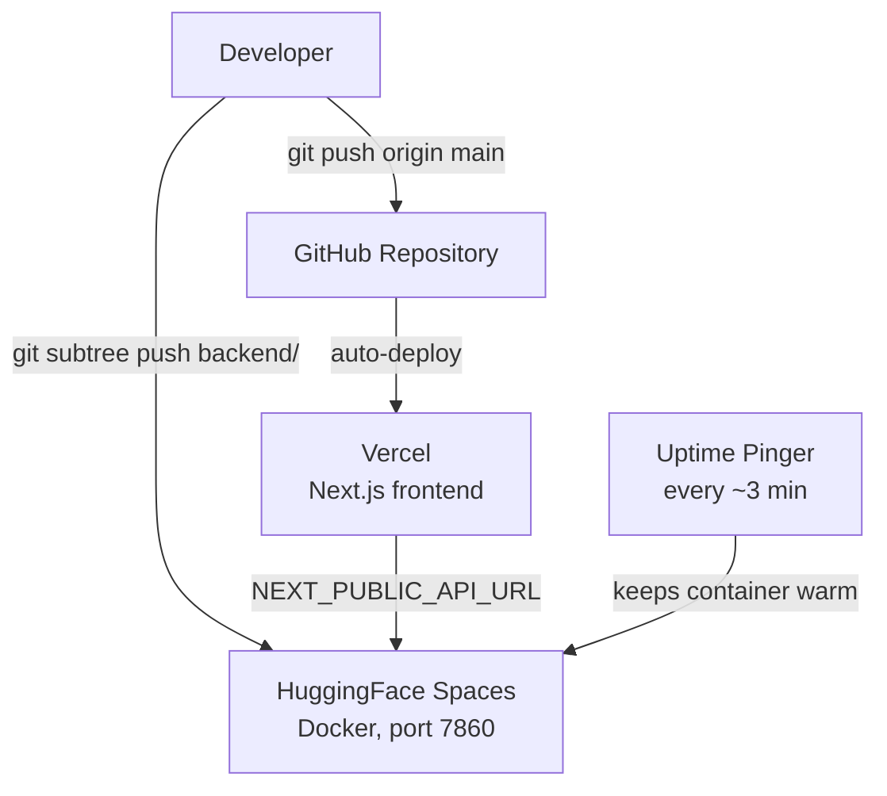

<div align="center">


# SentinelIQ

### AI-Powered Insider Threat Detection for the Modern SOC

**Catch the attacker who already has a valid login - in seconds, not months.**

[](https://github.com/TeamSigmoidIdea20/sentineliq)
[](#-why-it-fits-open-innovation)
[](#-the-problem)
[](https://sentineliq-gold.vercel.app/)

[](https://www.python.org/)
[](https://fastapi.tiangolo.com/)
[](https://pytorch.org/)
[](https://scikit-learn.org/)
[](https://xgboost.ai/)
[](https://shap.readthedocs.io/)
[](https://nextjs.org/)
[](https://www.typescriptlang.org/)
[](https://www.sqlite.org/)
[](https://sentineliq-gold.vercel.app/)
[](https://rak2315-sentineliq-backend.hf.space/health)

**[🌐 Live Demo](https://sentineliq-gold.vercel.app/)** &nbsp;·&nbsp;
**[🎬 Demo Video](https://youtu.be/ebN6C0Ewx7U)** &nbsp;·&nbsp;
**[⚙️ Backend API](https://rak2315-sentineliq-backend.hf.space/health)** &nbsp;·&nbsp;
**[🏗️ Architecture](#%EF%B8%8F-architecture)**

<br/>


</div>

---

> **SentinelIQ** learns what "normal" looks like for every privileged user, scores every action they take in real time with a **3-model ML ensemble**, and explains every alert with **SHAP feature attribution** and a plain-English narrative. The result: a security analyst goes from *alert fired* to *decision made* in under 30 seconds.

## 📑 Table of Contents

- [🚨 The Problem](#-the-problem)
- [🛡️ The Solution](#%EF%B8%8F-the-solution)
- [🎯 Why It Fits Open Innovation](#-why-it-fits-open-innovation)
- [📸 Product Tour](#-product-tour)
- [🏗️ Architecture](#%EF%B8%8F-architecture)
- [🧠 The ML Engine](#-the-ml-engine)
- [🔬 Benchmark Validation](#-benchmark-validation-cmu-cert-r42)
- [🧰 Tech Stack](#-tech-stack)
- [🚀 Quick Start](#-quick-start)
- [🎬 60-Second Demo Guide](#-60-second-demo-guide)
- [🔌 API Reference](#-api-reference)
- [📁 Project Structure](#-project-structure)
- [⚠️ Limitations & 🗺️ Roadmap](#%EF%B8%8F-limitations)

---

## 🚨 The Problem

**The most dangerous attacker already has a valid login.** Insiders (employees, admins, contractors, or anyone whose credentials have been stolen) walk straight past firewalls, antivirus and perimeter defences, because every action they take looks authorised.

<div align="center">

| 💸 **$19.5M** | ⏱️ **67 days** | 🔒 **0** |
|:---:|:---:|:---:|
| Average annual insider risk cost per organisation | Average time to contain an insider incident | Firewalls that can stop someone already inside |

<sub>Source: Ponemon Institute, *2026 Cost of Insider Risks Global Report*</sub>

</div>

Most organisations still rely on **static rules** ("flag transfers over ₹10 lakh") and **periodic audits**. Neither knows what normal looks like for *each individual user*. So an admin escalating their own privileges at 3 AM, or an analyst quietly exporting 50x their usual data volume, goes unnoticed until the damage is done.

Banks and fintechs feel this the hardest: a single privileged action can move money or leak thousands of customer records.

---

## 🛡️ The Solution

SentinelIQ is an **AI-driven cybersecurity platform** that builds a dynamic behavioural baseline for every monitored user and raises an explained alert the moment behaviour deviates. It works in real time, not after a quarterly audit.

| | Capability | What it does |
|:---:|---|---|
| 🧬 | **Per-user behavioural baselines** | Every user is scored against their *own* history, not a generic role profile |
| 🤖 | **3-model ML ensemble** | Isolation Forest + LSTM Autoencoder + XGBoost score every event in parallel |
| 🔍 | **SHAP explainability** | Every alert shows exactly which behaviours drove the score, and by how much |
| 🗣️ | **Plain-English narratives** | An LLM turns the real numbers into a short summary for non-technical investigators |
| 🔗 | **Kill-chain case detection** | 2+ alerts from the same user within 24h are stitched into one attack case with a timeline |
| 👥 | **Peer comparison** | Each suspect is compared against same-role peers on download, access, off-hours and velocity |
| 🔁 | **Active learning loop** | Analyst True/False Positive labels retrain XGBoost, so the system gets sharper with use |
| 🚦 | **Coordinated attack banners** | The same attack pattern across 3+ users in 30 minutes is flagged as coordinated activity |
| 📡 | **SIEM integration** | Ingest real logs via `POST /api/ingest`; critical alerts (risk ≥ 80) fire an outbound webhook |
| 📦 | **Evidence export** | One-click JSON evidence package per alert for audit and compliance handoff |

> 🏦 **Flagship use case:** the live demo monitors a simulated bank workforce (tellers, analysts, managers, admins, treasury officers), where insider abuse is most costly. The detection pipeline itself is domain-agnostic: it scores *behaviour*, not job titles.

---

## 🎯 Why It Fits Open Innovation

| Track objective | How SentinelIQ delivers |
|---|---|
| 💡 **Innovation & problem-solving** | Replaces static rules with per-user behavioural baselines and a 3-model ensemble. Unsupervised models catch attacks nobody has written a rule for yet. |
| ⚙️ **Functional, scalable prototype** | Fully deployed and live. Events stream, get scored, alerted, explained and grouped into cases continuously. The event-driven design scales by swapping SQLite for PostgreSQL and adding a message queue, not by rewriting. |
| 🌍 **Genuine challenge, practical value** | Insider threats are one of the costliest, hardest-to-detect attack classes in cybersecurity. SentinelIQ plugs into existing logs through `/api/ingest`. |
| 🏆 **Creativity, technical excellence, user impact** | SHAP evidence and plain-English narratives make ML decisions trustworthy for analysts. Validated against the CMU CERT r4.2 insider-threat benchmark, and it caught a real CERT insider live. |

---

## 📸 Product Tour

<table>
  <tr>
    <td width="50%" valign="top">
      
      <p align="center"><b>📊 Overview</b><br/><sub>Live intelligence feed, headline stats, recent alerts and a one-click attack simulator</sub></p>
    </td>
    <td width="50%" valign="top">
      
      <p align="center"><b>🔍 Alert Investigation</b><br/><sub>Per-model scores, SHAP attribution, peer comparison, AI narrative and analyst actions</sub></p>
    </td>
  </tr>
  <tr>
    <td width="50%" valign="top">
      
      <p align="center"><b>🔗 Kill-Chain Cases</b><br/><sub>Related alerts stitched into one case with a typed investigation timeline</sub></p>
    </td>
    <td width="50%" valign="top">
      
      <p align="center"><b>🧠 Model Intelligence</b><br/><sub>Model cards, precision / recall / F1, alert volume and a live retraining pipeline</sub></p>
    </td>
  </tr>
  <tr>
    <td colspan="2">
      
      <p align="center"><b>👥 User Monitoring</b><br/><sub>Every monitored employee ranked by live risk, with watchlist, restrict and escalate actions</sub></p>
    </td>
  </tr>
</table>

---

## 🏗️ Architecture

### 1. Real-Time Detection Pipeline

Every event (live, simulated or ingested from a SIEM) takes the same path through the engine.



### 2. System Architecture



### 3. Analyst Decision & Active Learning Loop


### 4. Deployment



---

## 🧠 The ML Engine

### Three models, three reasons to be suspicious

| Model | Type | What it catches | Weight | Config |
|---|---|---|:---:|---|
| 🌲 **Isolation Forest** | Unsupervised | *Point anomalies*: a single event that sits far outside the normal cluster | **40%** | 100 trees, contamination 0.1 |
| 🔄 **LSTM Autoencoder** | Unsupervised, temporal | *Behavioural drift*: sequences of events that no longer look like the user's normal rhythm | **40%** | seq_len 10, hidden 16 |
| 🎯 **XGBoost** | Supervised | *Known attack signatures*: events that match labelled attack patterns | **20%** | 60 trees, depth 3, proba capped at 0.88 |

The ensemble blends the three 0-1 scores into a single **0-100 risk score**. Alerts fire at **65**, and **80+** is critical. When models disagree, that disagreement is itself shown to the analyst.

### 8 behavioural signals per event

| # | Feature | Measures |
|:---:|---|---|
| 1 | `login_hour_deviation` | How far this login time is from the user's normal hours |
| 2 | `transaction_velocity_ratio` | Transactions vs. the user's own average |
| 3 | `access_entropy` | Shannon entropy of departments accessed (spread of access) |
| 4 | `download_volume_zscore` | How unusual this download volume is for the user |
| 5 | `location_mismatch` | Access from a location outside the user's normal set |
| 6 | `privilege_use_ratio` | How often privileged actions are being used |
| 7 | `device_change_frequency` | How often the user is switching devices |
| 8 | `off_hours_ratio` | Share of recent activity outside business hours |

### 6 insider attack patterns

| Pattern | Real-world behaviour | Dashboard simulator scenario |
|---|---|---|
| 🌙 `off_hours_login` | Logging in at 3 AM when the user normally works 9 to 5 | Off-Hours Treasury Access |
| 📤 `bulk_download` | Exporting a huge volume of records (data exfiltration) | Bulk Data Exfiltration |
| 🧭 `cross_department_access` | Querying systems outside the user's department | - |
| 🔑 `privilege_escalation` | Granting themselves elevated rights | Privilege Escalation |
| ⚡ `velocity_spike` | 8-15x the user's usual transaction count | - |
| ✏️ `account_modification` | Tampering with account records | Account Record Tampering |

---

## 🔬 Benchmark Validation (CMU CERT r4.2)

No real-world insider-threat dataset from a financial institution is public, so we validated our synthetic behaviour against **CMU CERT r4.2**, the standard insider-threat benchmark used across academic UEBA research (220k+ logon events analysed).

- ✅ **Validated:** both SentinelIQ and CERT are strongly business-hours-dominant with rare off-hours activity, which confirms the off-hours signal is well-founded.
- 🧪 **Honest finding:** CERT has a small (~4.5%) background of benign night activity, while our default synthetic baseline is ~0% (idealised). An **optional CERT calibration** samples login hours from CERT's real distribution to close this gap (off by default).
- 🎯 **Caught a real insider:** `scripts/cert/cert_to_ingest.py` replays documented CERT malicious insider **CAH0936** (off-hours logon → USB connect → data upload) through `POST /api/ingest`. SentinelIQ flags it at **risk 84**.

Tooling lives in [`scripts/cert/`](scripts/cert/). The CERT data itself is not committed (multi-GB); see that folder's README to reproduce.

### Model performance (synthetic test set)

| Model | Precision | Recall | F1 |
|---|:---:|:---:|:---:|
| Isolation Forest | 0.81 | 0.76 | 0.78 |
| LSTM Autoencoder | 0.84 | 0.79 | 0.81 |
| XGBoost | 0.88 | 0.83 | 0.85 |
| **Ensemble (0.4 / 0.4 / 0.2)** | **0.91** | **0.86** | **0.88** |

<sub>Measured on synthetic data. Production use requires retraining on real labelled activity logs.</sub>

### 100% synthetic data

No real organisation's data was used at any stage. `backend/data/synthetic_generator.py` simulates **50 employees across 5 roles** (teller, analyst, manager, admin, treasury_officer), each with realistic login hours, Gaussian transaction and download volumes, typical departments and locations. Attack patterns are injected at a ~7% rate.

---

## 🧰 Tech Stack

| Layer | Technology |
|---|---|
| 🎨 **Frontend** | Next.js 14, TypeScript, Tailwind CSS, Framer Motion, Recharts |
| ⚙️ **Backend** | FastAPI, Uvicorn, SQLAlchemy (async), aiosqlite, Pydantic |
| 🧠 **Machine learning** | scikit-learn (Isolation Forest), PyTorch (LSTM Autoencoder), XGBoost, SHAP |
| 🗣️ **Narratives** | Grok (`grok-3-mini`) via OpenAI-compatible SDK, optional |
| 🗄️ **Database** | SQLite in WAL mode |
| ☁️ **Hosting** | Vercel (frontend), HuggingFace Spaces Docker (backend) |
| 🔬 **Validation** | CMU CERT r4.2 insider-threat benchmark |

---

## 🚀 Quick Start

**Prerequisites:** Python 3.10, Node.js 18+, Git LFS

**1. Clone**
```bash
git lfs install
git clone https://github.com/TeamSigmoidIdea20/sentineliq.git
cd sentineliq
```

**2. Backend**
```bash
cd backend
python -m venv venv
venv\Scripts\activate            # macOS/Linux: source venv/bin/activate
pip install -r requirements.txt
cp .env.example .env              # optional: add GROK_API_KEY for AI narratives
uvicorn main:app --reload --port 8000
```
The first run generates 2,000 synthetic training events, trains all three models and seeds demo data. The backend is ready at `http://localhost:8000`.

**3. Frontend** (new terminal)
```bash
cd frontend
npm install
cp .env.local.example .env.local  # NEXT_PUBLIC_API_URL=http://localhost:8000
npm run dev
```
Open **http://localhost:3000** 🎉

> ⏳ The hosted backend runs on the HuggingFace free tier and sleeps after ~15 min idle. Open [`/health`](https://rak2315-sentineliq-backend.hf.space/health) and wait for `{"status":"ok"}` before demoing (cold start ~30-60s).

---

## 🎬 60-Second Demo Guide

1. 🌐 Open the [landing page](https://sentineliq-gold.vercel.app/), then **View Live Demo**. The live feed is already streaming.
2. 💉 Click **Simulate → Bulk Data Exfiltration**. A new high-risk alert lands within seconds.
3. 🔍 Open the alert: per-model scores, SHAP attribution, peer comparison and the plain-English narrative.
4. 🔗 Go to **Cases** to see alerts stitched into a kill-chain timeline.
5. 🏷️ Label a few alerts True/False Positive, then **Run Training Pipeline** on the **Intelligence** page to watch active learning retrain XGBoost.

---

## 🔌 API Reference

<details>
<summary><b>Click to expand all endpoints</b></summary>

| Method | Endpoint | Purpose |
|---|---|---|
| `GET` | `/health` · `/ping` | Health check, models loaded, DB connected |
| `GET` | `/api/stats` | Users, alerts (24h), high-risk count, FP rate, coordinated patterns |
| `GET` | `/api/feed` | Last 20 live events |
| `GET` | `/api/alerts` | Filterable alert list (`risk_level`, `status`, `time_range`, `min_score`, paging) |
| `GET` | `/api/alerts/{id}` | Full alert with model scores, SHAP values and AI narrative |
| `GET` | `/api/alerts/{id}/timeline` | Investigation timeline for one alert |
| `GET` | `/api/alerts/{id}/peer-comparison` | User vs. same-role peers on 4 metrics |
| `GET` | `/api/alerts/{id}/export` | JSON evidence package download |
| `POST` | `/api/alerts/{id}/resolve` · `/dismiss` | Close an alert |
| `POST` | `/api/alerts/{id}/label` | TP/FP label for active learning |
| `POST` | `/api/alerts/{id}/note` | Free-text analyst note |
| `GET` | `/api/users` · `/api/users/{id}` | User list, 30-day risk history and recent alerts |
| `GET` | `/api/users/{id}/events` | Event timeline for one user |
| `POST` | `/api/users/{id}/restrict` · `/escalate` | Restrict or escalate a user |
| `GET` | `/api/cases` · `/api/cases/{id}/timeline` | Kill-chain cases and their stitched timelines |
| `POST` | `/api/cases/{id}/resolve` · `/dismiss` | Close a case |
| `GET` | `/api/intelligence` | P/R/F1, model agreement, alert volume, FP trend, department risk |
| `GET` | `/api/model-info` | Model configuration and training metadata |
| `GET` | `/api/audit-log` | Analyst action audit trail |
| `GET` `POST` | `/api/settings/webhook` | Read or set the critical-alert webhook URL |
| `POST` | `/api/ingest` | Ingest an external event (SIEM, CERT replay) |
| `POST` | `/api/simulate` | Inject an attack scenario |
| `POST` | `/api/retrain` | Retrain XGBoost on analyst labels (needs 10+) |

Interactive docs are available at `/docs` (Swagger UI) on any running backend.

</details>

---

## 📁 Project Structure

<details>
<summary><b>Click to expand</b></summary>

```
sentineliq/
├── backend/
│   ├── main.py                     - FastAPI app, all endpoints, live event loop
│   ├── database.py                 - SQLAlchemy async models (SQLite WAL)
│   ├── schemas.py                  - Pydantic request/response models
│   ├── llm_narrative.py            - plain-English alert narratives
│   ├── Dockerfile                  - HuggingFace Spaces container (port 7860)
│   ├── data/
│   │   ├── synthetic_generator.py  - 50-user event stream, 6 attack patterns
│   │   ├── feature_engineering.py  - 8 rolling-window behavioural features
│   │   └── cert_profile.json       - real CERT login-hour distribution
│   └── models/
│       ├── isolation_forest.py     - point anomaly detector
│       ├── lstm_autoencoder.py     - temporal drift detector
│       ├── xgboost_model.py        - supervised scorer + SHAP TreeExplainer
│       └── ensemble.py             - weighted blend (0.4 / 0.4 / 0.2)
├── frontend/
│   ├── app/
│   │   ├── page.tsx                - landing page
│   │   └── dashboard/              - overview, alerts, cases, intelligence, users
│   ├── components/                 - AlertPanel, SHAPChart, CommandPalette, LiveFeed, ...
│   └── lib/
│       ├── api.ts                  - typed API client
│       └── tokens.ts               - design tokens
├── scripts/cert/                   - CMU CERT r4.2 validation + insider replay
└── docs/                           - walkthroughs and README images
```

</details>

---

## ⚠️ Limitations

- 🧪 Trained on synthetic data only. Production deployment needs real labelled activity logs.
- 🗄️ SQLite is right-sized for a POC; production would use PostgreSQL for write throughput.
- 💤 The free HuggingFace tier has ephemeral storage (data resets on restart) and sleeps when idle.
- 🔄 The live feed uses 3-second HTTP polling rather than WebSockets.
- 🔍 SHAP covers XGBoost only; Isolation Forest and LSTM give scores without a per-feature breakdown.
- 🔐 The dashboard has no authentication yet.

## 🗺️ Roadmap

- [ ] 🗺️ MITRE ATT&CK technique mapping on every alert
- [ ] 🔥 24h × 7d activity heatmap per user
- [ ] ⏱️ Live decision timer on open alerts
- [ ] ⚡ WebSocket streaming instead of polling
- [ ] 🔐 Role-based analyst authentication
- [ ] 🐘 PostgreSQL + message queue for enterprise scale

---

<div align="center">

**Built with ❤️ by Team SIGMOID for CodeArambh 2.0 · Open Innovation Track**

📧 [rehtrooper@gmail.com](mailto:rehtrooper@gmail.com) &nbsp;·&nbsp; 🌐 [Live Demo](https://sentineliq-gold.vercel.app/) &nbsp;·&nbsp; 🎬 [Demo Video](https://youtu.be/ebN6C0Ewx7U)

<sub>⭐ If SentinelIQ caught your attention, give the repo a star!</sub>

</div>
