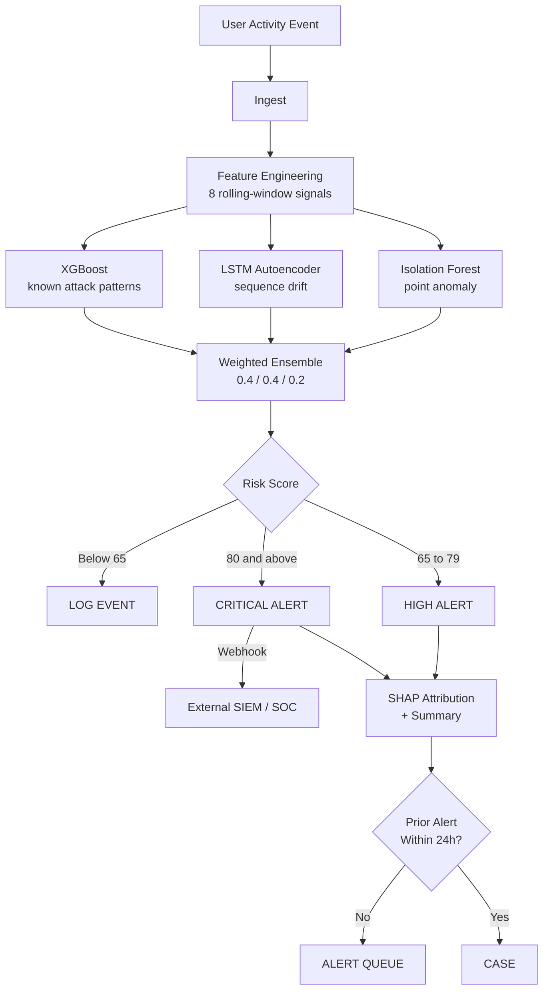
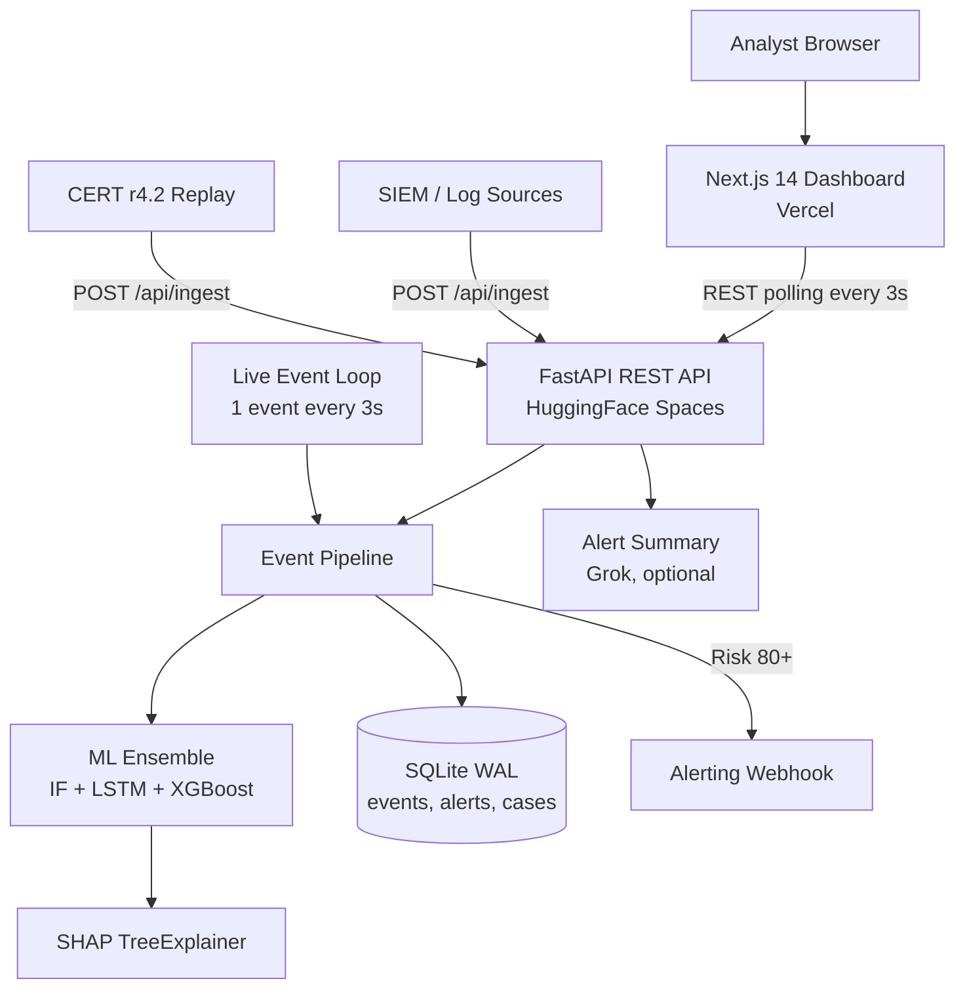
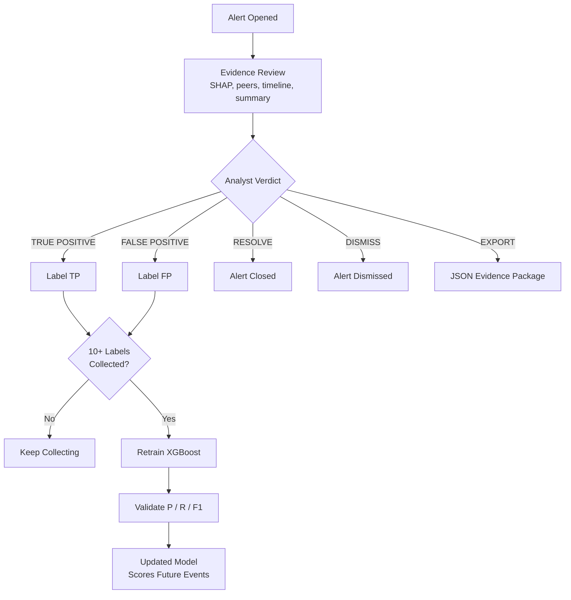
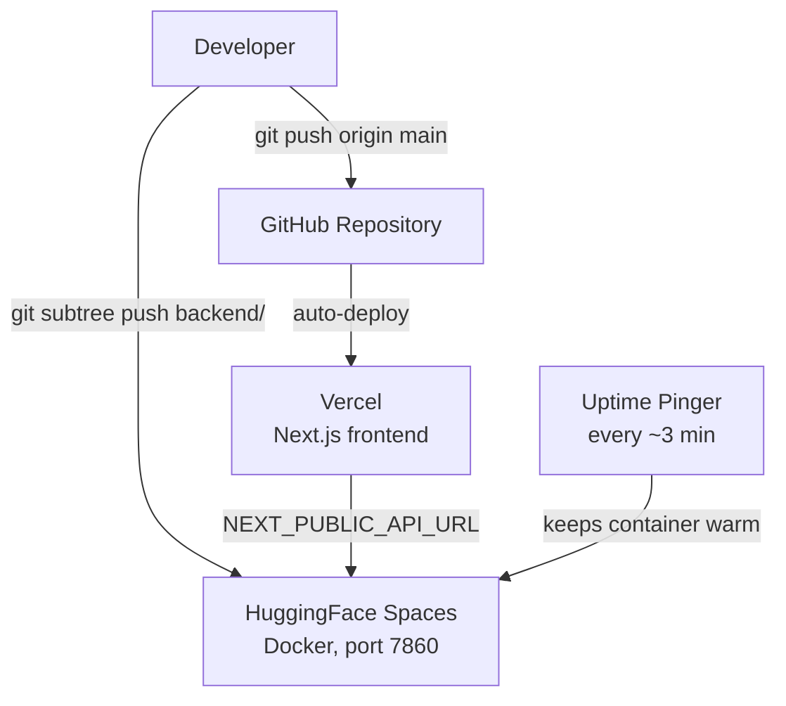

<p align="center">
  
</p>

<h1 align="center">SentinelIQ</h1>

<p align="center">
  Real-time insider threat detection with a 3-model ML ensemble and explainable alerts.
</p>

<p align="center">
  
  
  
  
  
  
</p>

<p align="center">
  <a href="https://sentineliq-gold.vercel.app/">Live demo</a> ·
  <a href="https://youtu.be/ebN6C0Ewx7U">Demo video</a> ·
  <a href="https://rak2315-sentineliq-backend.hf.space/health">Backend API</a>
</p>

<p align="center">
  
</p>

Built by Team SIGMOID for CodeArambh 2.0 (Open Innovation track, cybersecurity).

## Contents

- [Problem](#problem)
- [What SentinelIQ does](#what-sentineliq-does)
- [Screenshots](#screenshots)
- [Architecture](#architecture)
- [Models and features](#models-and-features)
- [Validation against CMU CERT](#validation-against-cmu-cert)
- [Tech stack](#tech-stack)
- [Running locally](#running-locally)
- [Trying the demo](#trying-the-demo)
- [API](#api)
- [Project structure](#project-structure)
- [Limitations](#limitations)
- [What's next](#whats-next)
- [The idea in short](#the-idea-in-short)

## Problem

Most security tooling is built to keep attackers out. Insiders are already in. An employee, an admin, a contractor, or anyone using stolen credentials can do real damage while every action they take looks authorised, so firewalls and antivirus never fire.

The Ponemon Institute's 2026 Cost of Insider Risks report puts the average cost at $19.5M per organisation per year, and the average incident takes 67 days to contain.

The usual defences are fixed rules ("flag transfers above X") and periodic audits. Neither knows what normal looks like for a specific person. An admin who grants themselves extra privileges at 3 AM, or an analyst who exports 50 times their usual data volume, does not break a rule. They only break their own pattern, and nobody is watching for that.

Banks and fintechs are where this hurts most, because a single privileged action can move money or expose thousands of customer records. That is the setting we built the demo around.

## What SentinelIQ does

SentinelIQ keeps a behavioural baseline for every monitored user and scores each new action against it as it happens.

- Each event is turned into 8 behavioural features, measured against that user's own recent activity.
- Three models score the event: an Isolation Forest, an LSTM autoencoder and an XGBoost classifier. Their scores are blended into one risk score from 0 to 100.
- A score of 65 or more creates an alert. 80 or more is treated as critical and can trigger an outbound webhook.
- Every alert carries a SHAP breakdown of which features pushed the score up, and a short plain-English summary of what happened.
- A second alert for the same user within 24 hours opens a case, with all related events laid out on one timeline.
- If the same attack pattern shows up across three or more users within 30 minutes, the dashboard flags it as coordinated activity.
- Analysts can resolve, dismiss, add notes, restrict or escalate a user, and export the evidence as JSON.
- Analysts label alerts as true or false positives. Once there are 10 labels, XGBoost can be retrained on them from the dashboard.
- External systems can push their own events through `POST /api/ingest`.

Nothing is blocked automatically. The system is investigation-only: it surfaces and explains, and a person decides.

The demo monitors a simulated bank workforce of 50 employees (tellers, analysts, managers, admins, treasury officers). The pipeline does not depend on banking, though. It works on behaviour, so the same approach applies to any organisation with privileged users.

## Screenshots

| Overview | Alert investigation |
|---|---|
|  |  |
| Live event feed, headline numbers, recent alerts and the attack simulator. | Per-model scores, SHAP attribution, peer comparison, summary and analyst actions. |

| Cases | Model intelligence |
|---|---|
|  |  |
| Related alerts grouped into a case with an investigation timeline. | Model configuration, precision / recall / F1, alert volume and retraining. |


All monitored users ranked by current risk, with watchlist, restrict and escalate.

## Architecture

### Detection pipeline

Every event takes the same path, whether it comes from the live stream, the simulator or an external system.



### System



### Analyst feedback loop



### Deployment



## Models and features

We use three models because each one notices a different kind of problem.

| Model | Type | Looks for | Weight | Settings |
|---|---|---|---|---|
| Isolation Forest | Unsupervised | A single event far outside the normal cluster | 0.4 | 100 trees, contamination 0.1 |
| LSTM Autoencoder | Unsupervised, sequential | A run of events that no longer matches the user's usual rhythm | 0.4 | sequence length 10, hidden size 16 |
| XGBoost | Supervised | Events that resemble labelled attack patterns | 0.2 | 60 trees, depth 3, probability capped at 0.88 |

The two unsupervised models carry most of the weight because they do not need labelled attacks, so they can flag behaviour nobody has seen before. XGBoost is weighted lower and is the one that improves with analyst labels.

**Features** (computed per event, per user, over a rolling window of that user's recent events):

| Feature | What it measures |
|---|---|
| `login_hour_deviation` | Distance of this login from the user's normal working hours |
| `transaction_velocity_ratio` | Transactions compared with the user's own average |
| `access_entropy` | How spread out the user's department access is (Shannon entropy) |
| `download_volume_zscore` | How unusual the download size is for this user |
| `location_mismatch` | Whether the location is outside the user's usual set |
| `privilege_use_ratio` | How often privileged actions are being used |
| `device_change_frequency` | How often the user switches devices |
| `off_hours_ratio` | Share of recent activity outside business hours |

**Attack patterns** in the synthetic data, injected at roughly 7% of events:

| Pattern | Behaviour | In the simulator |
|---|---|---|
| `off_hours_login` | Logging in at 3 AM when the user normally works 9 to 5 | Off-Hours Treasury Access |
| `bulk_download` | Exporting an unusually large volume of records | Bulk Data Exfiltration |
| `cross_department_access` | Querying systems outside the user's department | not exposed |
| `privilege_escalation` | Granting themselves elevated rights | Privilege Escalation |
| `velocity_spike` | 8 to 15 times the usual transaction count | not exposed |
| `account_modification` | Changing account records | Account Record Tampering |

**Results on the synthetic test set:**

| Model | Precision | Recall | F1 |
|---|---|---|---|
| Isolation Forest | 0.81 | 0.76 | 0.78 |
| LSTM Autoencoder | 0.84 | 0.79 | 0.81 |
| XGBoost | 0.88 | 0.83 | 0.85 |
| Ensemble | 0.91 | 0.86 | 0.88 |

These numbers come from synthetic data, so treat them as a sanity check and not a production benchmark.

## Validation against CMU CERT

All data in this project is synthetic. No real organisation's data was used. Since there is no public insider-threat dataset from a real financial institution, we checked our generator against CMU CERT r4.2, the dataset most insider-threat research uses.

What we found, using about 220k CERT logon events:

- Both datasets are dominated by business-hours activity with very little at night, which supports using off-hours activity as a signal.
- CERT has about 4.5% harmless night activity. Our default generator has close to none, which is cleaner than reality. We added an optional calibration mode that samples login hours from the CERT distribution. It is off by default.
- `scripts/cert/cert_to_ingest.py` replays a documented CERT insider (user CAH0936: off-hours logon, USB device, data upload) through `/api/ingest`. SentinelIQ scores it at 84.

The scripts are in [`scripts/cert/`](scripts/cert/). The CERT data itself is several GB and is not in the repo. That folder's README explains how to get it.

## Tech stack

| | |
|---|---|
| Frontend | Next.js 14, TypeScript, Tailwind CSS, Framer Motion, Recharts |
| Backend | FastAPI, Uvicorn, async SQLAlchemy, Pydantic |
| ML | scikit-learn, PyTorch, XGBoost, SHAP |
| Alert summaries | Grok (`grok-3-mini`), optional |
| Database | SQLite in WAL mode |
| Hosting | Vercel (frontend), HuggingFace Spaces with Docker (backend) |

## Running locally

You need Python 3.10, Node.js 18 or newer, and Git LFS.

```bash
git lfs install
git clone https://github.com/TeamSigmoidIdea20/sentineliq.git
cd sentineliq
```

Backend:

```bash
cd backend
python -m venv venv
venv\Scripts\activate            # macOS/Linux: source venv/bin/activate
pip install -r requirements.txt
cp .env.example .env
uvicorn main:app --reload --port 8000
```

On first start the backend generates 2,000 training events, trains the three models and seeds some demo data. This takes a little while. To get alert summaries locally, add a `GROK_API_KEY` to `backend/.env`.

Frontend, in a second terminal:

```bash
cd frontend
npm install
cp .env.local.example .env.local
npm run dev
```

Then open http://localhost:3000.

## Trying the demo

The hosted backend is on the free HuggingFace tier and goes to sleep when idle. If the dashboard looks empty, open the [health endpoint](https://rak2315-sentineliq-backend.hf.space/health), wait for `{"status":"ok"}` (up to a minute), and reload.

1. Open the [dashboard](https://sentineliq-gold.vercel.app/dashboard). The live feed should already be moving.
2. Use **Simulate** and pick Bulk Data Exfiltration. An alert appears within a few seconds.
3. Open the alert to see the model scores, SHAP breakdown, peer comparison and summary.
4. Go to **Cases** to see alerts for the same user grouped on a timeline.
5. Label some alerts as true or false positive, then run the training pipeline from the **Intelligence** page.

## API

<details>
<summary>Endpoints</summary>

| Method | Endpoint | Purpose |
|---|---|---|
| GET | `/health`, `/ping` | Health check |
| GET | `/api/stats` | Headline numbers and coordinated patterns |
| GET | `/api/feed` | Last 20 live events |
| GET | `/api/alerts` | Alert list with filters and paging |
| GET | `/api/alerts/{id}` | One alert with model scores, SHAP values and summary |
| GET | `/api/alerts/{id}/timeline` | Timeline for one alert |
| GET | `/api/alerts/{id}/peer-comparison` | User compared with same-role peers |
| GET | `/api/alerts/{id}/export` | Evidence package as JSON |
| POST | `/api/alerts/{id}/resolve`, `/dismiss` | Close an alert |
| POST | `/api/alerts/{id}/label` | True / false positive label |
| POST | `/api/alerts/{id}/note` | Analyst note |
| GET | `/api/users`, `/api/users/{id}` | Users, risk history and recent alerts |
| GET | `/api/users/{id}/events` | Event history for one user |
| POST | `/api/users/{id}/restrict`, `/escalate` | Restrict or escalate a user |
| GET | `/api/cases`, `/api/cases/{id}/timeline` | Cases and their timelines |
| POST | `/api/cases/{id}/resolve`, `/dismiss` | Close a case |
| GET | `/api/intelligence` | Model metrics and trends |
| GET | `/api/model-info` | Model configuration |
| GET | `/api/audit-log` | Analyst action log |
| GET, POST | `/api/settings/webhook` | Read or set the alert webhook |
| POST | `/api/ingest` | Push an external event |
| POST | `/api/simulate` | Inject an attack scenario |
| POST | `/api/retrain` | Retrain XGBoost on analyst labels |

Swagger docs are served at `/docs` on a running backend.

</details>

## Project structure

```
sentineliq/
├── backend/
│   ├── main.py                     FastAPI app, endpoints, live event loop
│   ├── database.py                 SQLAlchemy models
│   ├── schemas.py                  Pydantic models
│   ├── llm_narrative.py            alert summaries
│   ├── Dockerfile                  HuggingFace Spaces container
│   ├── data/
│   │   ├── synthetic_generator.py  50-user event stream, 6 attack patterns
│   │   ├── feature_engineering.py  the 8 behavioural features
│   │   └── cert_profile.json       login-hour distribution from CERT
│   └── models/
│       ├── isolation_forest.py
│       ├── lstm_autoencoder.py
│       ├── xgboost_model.py        includes the SHAP explainer
│       └── ensemble.py             weighted blend
├── frontend/
│   ├── app/                        landing page and dashboard pages
│   ├── components/
│   └── lib/                        API client and design tokens
├── scripts/cert/                   CERT validation and replay scripts
└── docs/                           walkthroughs and images
```

## Limitations

- The models are trained on synthetic data. A real deployment would need real, labelled activity logs.
- SQLite is fine for a prototype but would not hold up under production write volume.
- On the free HuggingFace tier the database is wiped whenever the container restarts.
- The dashboard polls every 3 seconds. It does not use WebSockets.
- SHAP explanations cover XGBoost only. The other two models give a score without a per-feature breakdown.
- The dashboard has no login.
- The LSTM is trained once at startup and is not retrained as behaviour changes.

## What's next

- Map each alert to a MITRE ATT&CK technique
- A per-user activity heatmap (hour by weekday)
- WebSocket streaming
- Analyst login with roles
- PostgreSQL and a message queue for larger deployments

## The idea in short

Rules and audits can only catch what someone thought to write a rule for, and they treat every employee the same. Insider attacks do not look like rule violations. They look like a trusted person behaving slightly unlike themselves.

So we stopped asking "did this break a rule?" and started asking "is this normal for this person?". SentinelIQ learns each user's own pattern, scores every action against it with three different models, and when something is off it tells the analyst exactly why, in terms they can check. The analyst makes the call, and their decision feeds back into the model.

## Contact

rehtrooper@gmail.com
